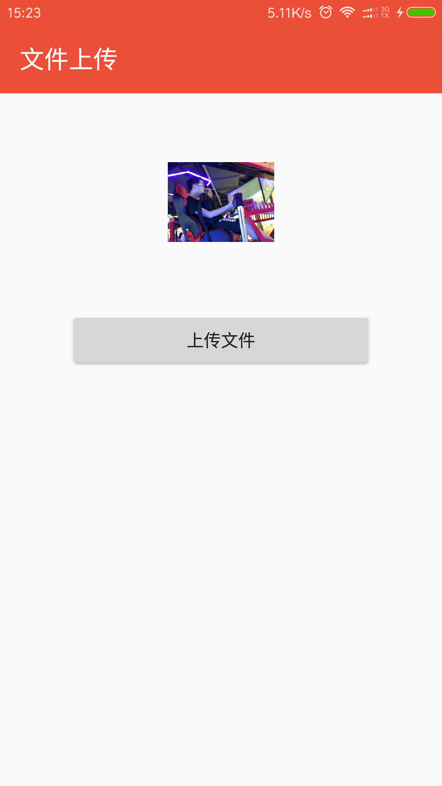
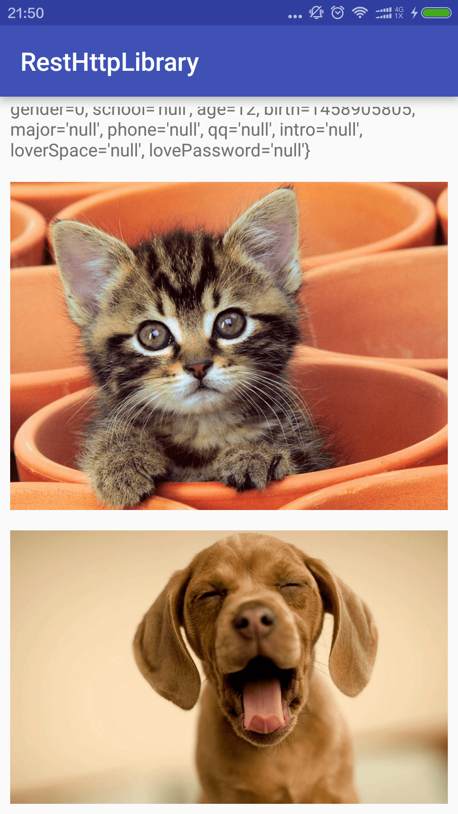
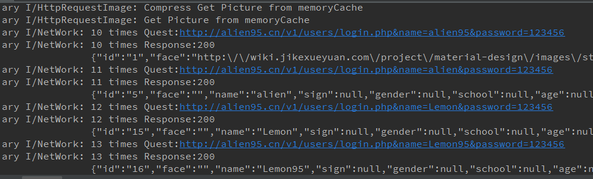

#RestHttp网络库 --- 基于HttpURLConnection

> - RestHttp提供了三级缓存（服务器缓存，内存缓存，硬盘缓存），通过动态代理的方式实现了面向接口调用API。
> - 封装了HttpURLConnection，简单易用的API设计。
> - Debug模式下设置日志TAG，所有网络请求日志输出，方便调试。

**gradle依赖**

``
    compile 'cn.alien95:resthttp:1.0.5'
``

##使用方法

 - 初始化：设置日志TAG

```java
public class App extends Application {
    @Override
    public void onCreate() {
        super.onCreate();

        RestHttp.initialize(this);
        Utils.initialize(this);
        RestHttp.setDiskCacheSize(100 * 1024 * 1024);
        if (BuildConfig.DEBUG) {
            Utils.setDebug(true,"Debug");
            RestHttp.setDebug(true, "network");
        }
    }
}
```

###通过接口定义API

 - API接口类

```java
public interface ServiceAPI {

    //同步请求方式：不能包含Callback参数
    @POST("/v1/users/login.php")
    UserInfo loginPostSync(@Field("name")
                   String name,
                   @Field("password")
                   String password);

    //异步请求：必须有一个Callback参数作为回调
    @POST("/v1/users/login.php")
    void loginAsyn(@Field("name")
                String name,
                   @Field("password")
                String password, RestCallback<UserInfo> restCallback);

    //GET请求同步
    @GET("/v1/users/login_get.php")
    UserInfo loginGetSync(@Query("name")
                          String name,
                          @Query("password")
                          String password);

    //GET请求异步
    @GET("/213-4")
    void getMusicData(@Query("topid") int topId,
                      @Query("showapi_appid") String showapiAppId,
                      @Query("showapi_sign") String secretKey,
                      RestCallback<String> callback);
}
```

###Java类方式请求数据

 - Http --- GET,POST

```
    public void get(){
        mResult.setText("");
        HttpRequest.getInstance().get(GET_URL, new HttpCallback() {
            @Override
            public void success(String info) {
                mResult.setText(new Gson().toJson(info));
            }
        });
    }

    public void post(){
        mResult.setText("");
        Map<String,String> params = new HashMap<>();
        params.put("page","1");
        HttpRequest.getInstance().addHeader("UID","1");
        HttpRequest.getInstance().addHeader("token","9ba712a6210728364ea7c2d7457cde");
        HttpRequest.getInstance().post(POST_URL, params,new HttpCallback() {
            @Override
            public void success(String info) {
                mResult.setText(new Gson().toJson(info));
            }
        });
    }
```

 - Http文件上传

 ```
 HttpFile.getInstance().uploadFile(UPLOAD_URL, null, "picture", mImageFile, new HttpCallback() {
      @Override
      public void success(String info) {
          Utils.Toast(info + " : http://115.29.107.20/image/test_upload.jpg");
      }
 }
 ```

 - Https

 ```
   HttpsRequest.getInstance().get("https://baidu.com/", new HttpsCallback() {
      @Override
      public void success(String info) {
           mResult.setText(info);
      }
   });
 ```

###图片加载 --- 支持大图压缩

 - HttpImageView

```xml
 <cn.alien95.resthttp.view.HttpImageView
     android:id="@+id/image"
     android:layout_width="match_parent"
     android:layout_height="wrap_content"
     android:layout_marginTop="16dp"
     android:adjustViewBounds="true" />
```
```
 imageView.setImageUrl(imageUrl);
```

 - 可以指定压缩比例或固定的宽和高

```
image.setInSimpleSize(inSimpleSize);
image.setImageUrlWithCompress(IMAGE_SMALL_URL, 800, 600);
```

###注意事项
        
 - 依赖的其他库

```
    compile 'com.jakewharton:disklrucache:2.0.2'
    compile 'com.google.code.gson:gson:2.6.2'      
```

###[Demo](https://github.com/llxdaxia/RestHttp/tree/dev/demo)





 - 日志打印輸出示例图

