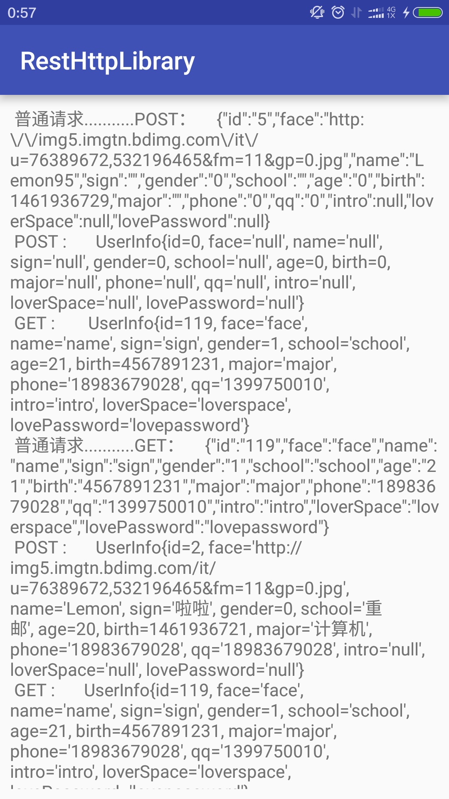

#RestHttp网络库 --- 基于HttpURLConnection

> - RestHttp提供了三级缓存（服务器缓存，内存缓存，硬盘缓存），通过动态代理的方式实现了面向接口调用API。
> - 封装了HttpURLConnection，简单易用的API设计。
> - Debug模式下设置日志TAG，所有网络请求日志输出，方便调试。

gradle依赖

```java
compile 'cn.alien95:resthttp:1.0.1-beta5'
```

##使用方法

初始化：设置日志TAG

```java
public class App extends Application {
    @Override
    public void onCreate() {
        super.onCreate();

        Http.initialize(this);
        if(BuildConfig.DEBUG){
            Http.setDebug(true,"NetWork");
        }
    }
}
```

###使用接口的方式请求网络数据：

API接口类

```java
public interface ServiceAPI {

    /**
     * 同步请求方式：不能包含Callback参数
     * @param name
     * @param password
     * @return 返回一个经过Gson解析后的对象
     */

    @POST("/v1/users/login.php")
    UserInfo login(@Field("name")
                   String name,
                   @Field("password")
                   String password);

    /**
     * 异步请求：必须有一个Callback参数作为回调
     * @param name
     * @param password
     * @param restCallback  回调泛型类
     */

    @POST("/v1/users/login.php")
    void loginAsyn(@Field("name")
                String name,
                   @Field("password")
                String password, RestCallback<UserInfo> restCallback);

    @GET("/v1/users/login_get.php")
    UserInfo loginGetSync(@Query("name")
                          String name,
                          @Query("password")
                          String password);

    @GET("/v1/users/login_get.php")
    void loginGetAsyn(@Query("name")
                          String name,
                          @Query("password")
                          String password,RestCallback<UserInfo> restCallback);

}
```

网络请求java类

```java
        final RestHttpRequest restHttpRequest = new RestHttpRequest.Builder()
                .baseUrl(BASE_URL)
                .build();

        final ServiceAPI serviceAPI = (ServiceAPI) restHttpRequest.create(ServiceAPI.class);

        /**
         * 同步操作,不受线程池控制，自己处理线程问题
         */
        new Thread(new Runnable() {
            @Override
            public void run() {
                final UserInfo userInfo = serviceAPI.login("Lemon", "123456");
                final UserInfo userInfo1 = serviceAPI.loginGetSync("Alien", "123456");
                handler.post(new Runnable() {
                    @Override
                    public void run() {
                        if (userInfo != null) {
                            result.setText(result.getText().toString() + "\n POST :       "
                                    + userInfo.toString());
                        }
                        if (userInfo1 != null) {
                            result.setText(result.getText().toString() + "\n GET :       " + userInfo1.toString());
                        } else {
                            RestHttpLog.i("userInfo1为空");
                        }
                    }
                });
            }
        }).start();

        /**
         * 异步操作，受线程池控制
         */
        serviceAPI.loginAsyn("Fuck", "12345", new RestCallback<UserInfo>() {
            @Override
            public void callback(UserInfo result) {
                if (result != null) {
                    MainActivity.this.result.setText(MainActivity.this.result.getText().toString() + "\n POST :       "
                            + result.toString());
                }

            }
        });

        serviceAPI.loginGetAsyn("Fucker", "123456", new RestCallback<UserInfo>() {
            @Override
            public void callback(UserInfo result) {
                if (result != null) {
                    MainActivity.this.result.setText(MainActivity.this.result.getText().toString() + "\n GET :        "
                            + result.toString());
                } else {
                    RestHttpLog.i("result为空");
                }

            }
        });

        HttpRequest.getInstance().get("http://alien95.cn/v1/users/login_get.php", new HttpCallback() {
            @Override
            public void success(String info) {
                result.setText(result.getText().toString() + "\n 通常请求方式...........GET：     " + info);
            }
        });

        HashMap<String, String> params = new HashMap<>();
        params.put("name", "Lemon95");
        params.put("password", "123456");
        HttpRequest.getInstance().post("http://alien95.cn/v1/users/login.php", params, new HttpCallback() {
            @Override
            public void success(String info) {
                result.setText(result.getText().toString() + "\n 通常请求方式...........POST：     " + info);
            }
        });
```
        
###通常的请求方式
        
GET请求

```java
HttpRequest.getInstance().get("http://alien95.cn/v1/users/login_get.php", new HttpCallback() {
            @Override
            public void success(String info) {
                result.setText(result.getText().toString() + "\n 通常请求方式...........GET：     " + info);
            }
        });
```

POST请求

```java
HashMap<String, String> params = new HashMap<>();
        params.put("name", "Lemon95");
        params.put("password", "123456");
        HttpRequest.getInstance().post("http://alien95.cn/v1/users/login.php", params, new HttpCallback() {
            @Override
            public void success(String info) {
                result.setText(result.getText().toString() + "\n 通常请求方式...........POST：     " + info);
            }
        });
```

###图片加载

xml布局文件

```xml
   <cn.alien95.resthttp.view.HttpImageView
       android:id="@+id/small_image"
       android:layout_width="match_parent"
       android:layout_height="wrap_content"
       android:layout_marginTop="16dp"
       android:adjustViewBounds="true" />

   <cn.alien95.resthttp.view.HttpImageView
       android:id="@+id/big_image"
       android:layout_width="match_parent"
       android:layout_height="wrap_content"
       android:layout_marginTop="16dp"
       android:adjustViewBounds="true" />
```

java代码

 - 可以指定压缩比例，固定的宽和高

```java
smallImage.setImageUrlWithCompress(IMAGE_SMALL_URL, 800, 600);
bigImage.setImageUrl(IMAGE_BIG_URL);                                      
```

 - 也可以通过：

```java
public void setInSimpleSize(int inSimpleSize);  来设置压缩比例
```

###注意事项
        
依赖的其他库

```java
    compile 'com.jakewharton:disklrucache:2.0.2'
    compile 'com.google.code.gson:gson:2.6.2'      
```
     
###[Demo](https://github.com/llxdaxia/RestHttp/tree/dev/app)



    
日志打印輸出：


